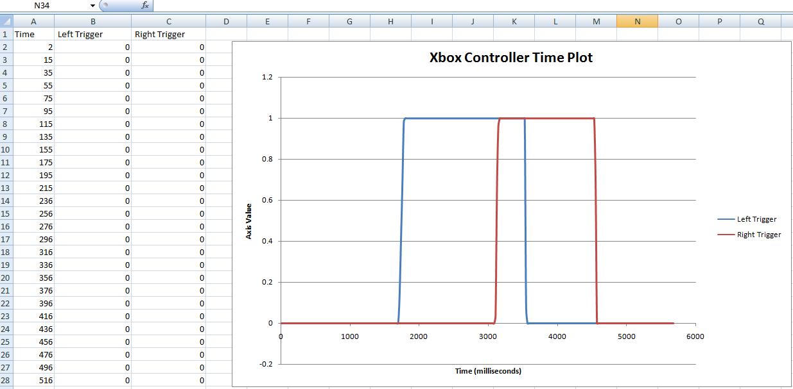

# BlackBox
BlackBox is a Toast Module designed to record data throughout an FRC match. 

BlackBox is designed to dump data to a `.csv` file that can easily be imported into applications
such as Excel or Tableau. This data can be used to graph how values change over time, or
for robot statistics. 

## Examples
A sample implementation is seen below:
```java
// A simple joystick recording example
Joystick myJoystick = new Joystick(0);
BlackBoxContext context = BlackBox.context("MyContext");

context.add("Joystick X", myJoystick::getX);
context.add("Joystick Y", myJoystick::getY);

// And then, in your Periodic Code....
context.tick();
```

This may generate the following output:

| Time | Joystick X | Joystick Y |
| ---- | ---------- | ---------- |
|    0 | 0.0        | 0.0        |
|   20 | 0.5        | 0.25       |
|   40 | 1.0        | 0.5        |

... and so on. 
The `time` field is measured in Milliseconds since the first tick. You can divide this by 1000
to get the seconds elapsed. 

Below is an example of a Joystick output from an Xbox controller, with the BlackBox file opened in 
Microsoft Excel and a Graph generated from the table.



All BlackBox files are stored under `toast/system/blackbox`

## Installation
To add BlackBox as a dependency for your Module, place the following in your `build.gradle`
```gradle
dependencies {
    compile group: 'jaci.openrio.modules', name: 'BlackBox', version: '+'
    toastModule group: 'jaci.openrio.modules', name: 'BlackBox', version: '+'
}
```

Next time you run `gradlew eclipse` or `gradlew idea`, the BlackBox Jar will be added as a dependency to your project.  
Next time you run `gradlew deploy`, BlackBox will be loaded onto your RoboRIO. 

If you wish to install BlackBox onto a USB Stick instead, remove the line in the above example starting with `toastModule` and instead download
the BlackBox jar from the [Releases Page](https://github.com/Open-RIO/BlackBox/releases) and copy it to the `toast/modules` directory on your USB device.